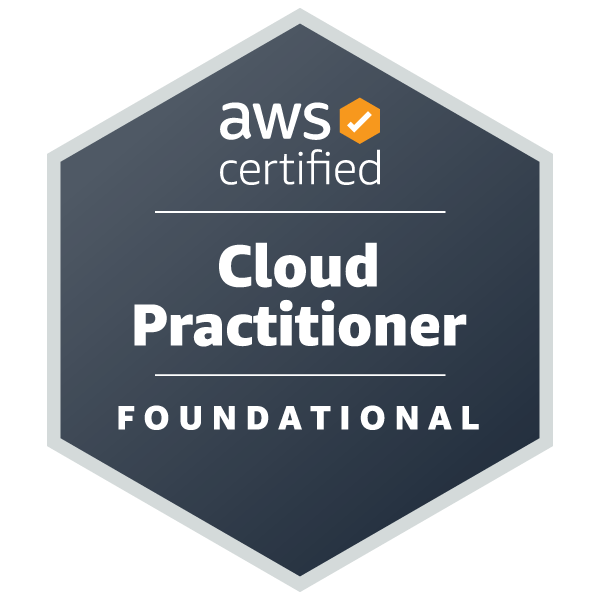
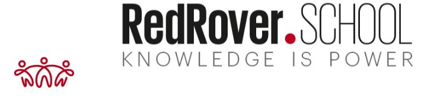

<image src="image/banner.jpg" alt="PORTFOLIO">

# Hi everyone! I'm Svetlana, a Software QA Engineer/SDET with experience in WDIO,  Playwright, and Cypress with JavaScript.

You can learn more about me on my GitHub.io and LinkedIn pages. I would be delighted to connect with you, share experiences and knowledge, and support your professional growth and development.

## Certifications and Profiles

## AWS Certification

  

### Codewars Profile

  

### LinkedIn Profile

  

## Mentor at RedRover School

  

<!--

--> 

